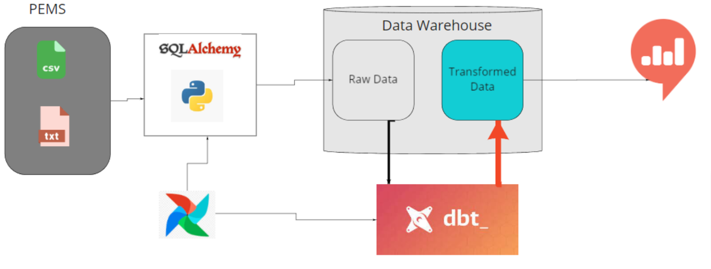

# trafficELT
A pipeline for transforming Extracting, Loading and Transforming data to businesses

<p align="center">
  <h3 align="center">Data Engineering Sensor Data</h3>

  <p align="center">
    A fully dockerized ELT pipeline project, using PostgreSQL, dbt, Apache Airflow, and Redash.
    <br />
    <a href="#"><strong>Explore the docs »</strong></a>
    <br />
    <br />
  </p>
</p>


<!-- TABLE OF CONTENTS -->
<details open="open">
  <summary>Table of Contents</summary>
  <ol>
    <li>
      <a href="#about-the-project">About The Project</a>
      <ul>
        <li><a href="#built-with">Built With</a></li>
      </ul>
    </li>
    <li>
      <a href="#getting-started">Getting Started</a>
      <ul>
        <li><a href="#prerequisites">Prerequisites</a></li>
        <li><a href="#installation">Installation</a></li>
      </ul>
    </li>
    <li><a href="#usage">Usage</a></li>
    <li><a href="#roadmap">Roadmap</a></li>
    <li><a href="#contributing">Contributing</a></li>
    <li><a href="#license">License</a></li>
    <li><a href="#contact">Contact</a></li>
    <li><a href="#acknowledgements">Acknowledgements</a></li>
  </ol>
</details>


<!-- ABOUT THE PROJECT -->
## About The Project



Using a docker-compose file, developed a completely dockerized ELT pipeline with PostgreSQL for data storage, Airflow for automation and orchestration, DBT for data transformation, and a Redash dashboard connected to the PostgreSQL database.
### Built With

Tech Stack used in this project
* [PostgreSQL](https://dev.PostgreSQL.com/doc/)
* [Apache Airflow](https://airflow.apache.org/docs/apache-airflow/stable/)
* [dbt](https://docs.getdbt.com/)
* [Redash](https://redash.io/help/)


<!-- GETTING STARTED -->
## Getting Started


### Prerequisites

Make sure you have docker installed on local machine.
* Docker
* DockerCompose
  
### Installation

1. Clone the repo
   ```sh
   git clone https://github.com/tutorialcreation/trafficELT.git
   ```
2. Run
   ```sh
    docker-compose build
    docker-compose up
   ```
3. Open Airflow web browser
   ```JS
   Navigate to `http://localhost:8000/` on the browser
   activate and trigger dbt_load_dag
   activate and trigger dbt_dbt_dag
   ```
4. Access redash dashboard
   ```JS
   Navigate to `http://localhost:5000/` on the browser
   ```
5. Access your PostgreSQL database using adminar
   ```JS
   Navigate to `http://localhost:8080/` on the browser
   choose PostgreSQL databse
   use `root` for username
   use `pssd` for password
   ```

<!-- CONTRIBUTING -->
## Contributing

Contributions are what make the open source community such an amazing place to learn, inspire, and create. Any contributions you make are **greatly appreciated**.

1. Fork the Project
2. Create your Feature Branch (`git checkout -b feature/AmazingFeature`)
3. Commit your Changes (`git commit -m 'Add some AmazingFeature'`)
4. Push to the Branch (`git push origin feature/AmazingFeature`)
5. Open a Pull Request


<!-- LICENSE -->
## License

Distributed under the MIT License. See `LICENSE` for more information.


<!-- CONTACT -->
## Contact

Martin Luther - [@email](https://www.linkedin.com/in/martin-bironga-0338a418b/) - tutorialcreation81@gmail.com


<!-- ACKNOWLEDGEMENTS -->
## Acknowledgements
* [10 Academy](https://www.10academy.org/)


